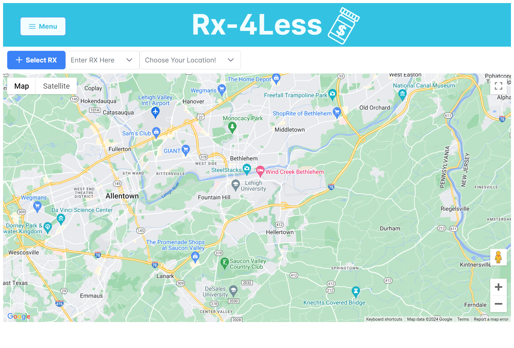
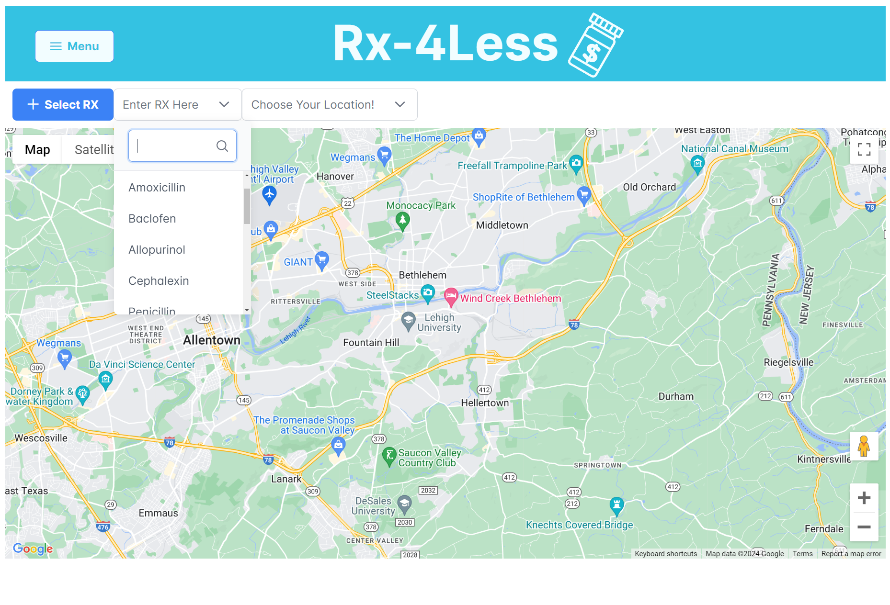
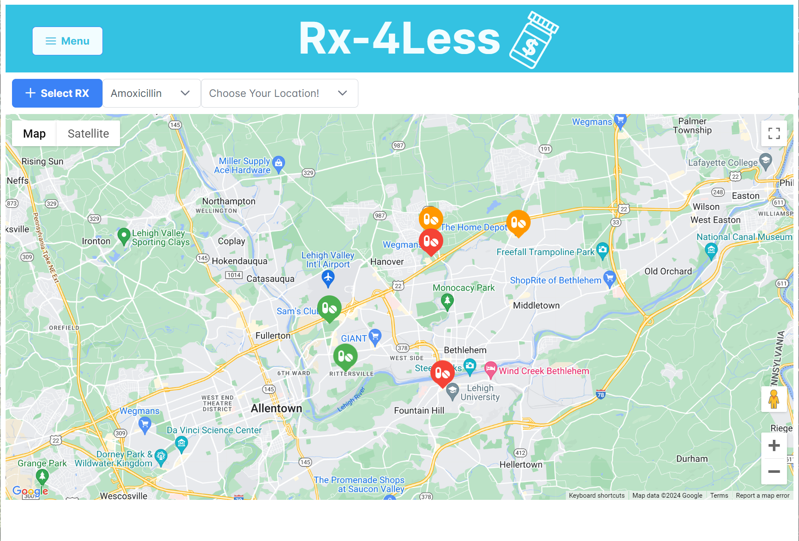
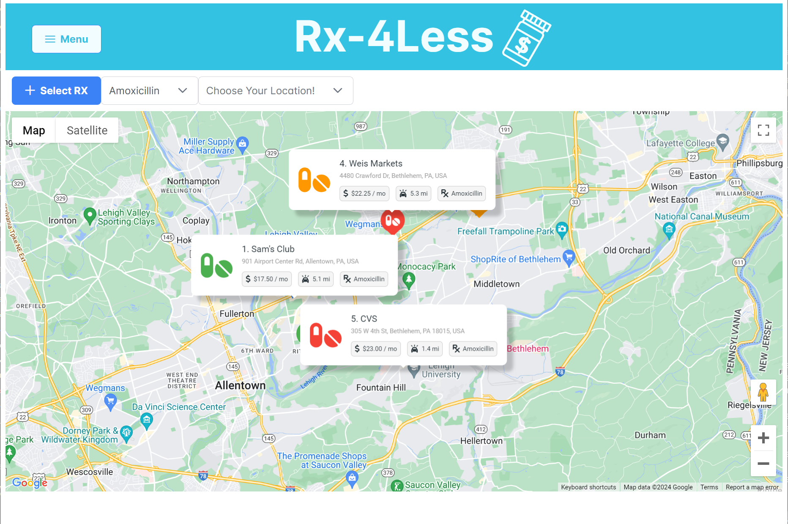
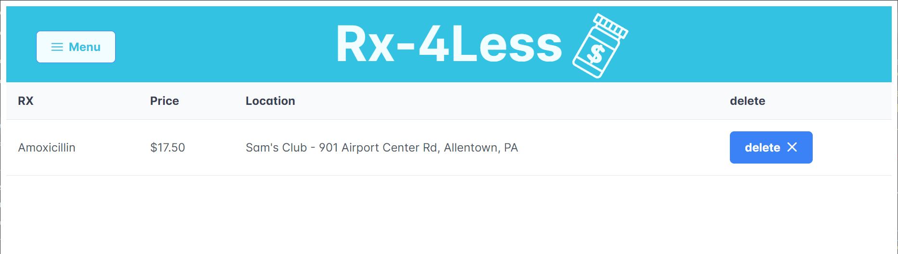

# Rx-4Less - PestControl

## Overview

**PestControl - Rx-4Less** is a project showcased at Lehigh Hacks for Health 2024, the second annual hackathon hosted by Lehigh University, sponsored by Google Cloud. The hackathon theme focused on devising healthcare-based software solutions addressing pressing challenges. Our team, PestControl, identified the high cost of medication as a significant barrier affecting people regardless of gender, age, insurance quality, or socioeconomic status. To tackle this, we developed **Rx-4Less**, a tool aimed at making medications more affordable by leveraging Google APIs and a flexible tech stack.

## Motivation

The issue of exorbitant medication prices affects many, especially those with poor insurance, those needing life-saving drugs, or the uninformed. The commercial pharmaceutical industry's structure, dominated by Pharmacy Benefit Managers (PBMs) working for major drug manufacturers, often results in inflated retail prices. **Rx-4Less** emerges as a solution, providing a means to find and compare affordable medication options.

## Features

- **Search Nearby Pharmacies:** Users can find nearby pharmacies according to their location.
- **Medication Search:** After selecting a medication, the map updates with detailed pins showing pharmacies within a selected radius offering the needed prescription.
- **Price Comparison:** Users can compare prices across different pharmacies and add medications to their profile for a streamlined UX, with options to view in 'List'/'Map' format.

We are thrilled to present **Rx-4Less** and its contributions to making healthcare more accessible.

## Team Pest Control

- Paolo Bartolucci, CSE '24
- Joseph Bereswill, CSB '24
- Mark Latvakoski, CSE '25
- Micah Worth, CSE '24

## User Experience Walkthrough

Our application, Rx-4Less, offers a user-friendly interface designed to help you find the most affordable medication options near you. Below is a step-by-step walkthrough of the user experience, featuring screenshots to guide you through each part of the process.

### Step 1: Landing Page Introduction

Upon arriving at Rx-4Less, you're presented with a clean and intuitive landing page. Central to this page is a Google Map view of your current area, paired with a search menu at the top. This is the landing page to finding your needed prescriptions at the best prices available nearby.



### Step 2: Searching for Medication

To begin your search, click on the search field at the top of the page. This action reveals a dropdown list, populated with all available medications in our database. The intuitive search function allows you to quickly find and select the prescription you need without navigating away from the page.



### Step 3: Viewing Pharmacy Options

After selecting a medication, such as Amoxicillin, the map updates to display map markers at the locations of providers stocking your prescription. These markers are color-coded for quick price reference: green indicates the cheapest options, orange for mid-range prices, and red for the most expensive.



### Step 4: Detailed Information on Selected Pharmacies

By clicking on any of the displayed pins, you can access detailed information about the pharmacy, including its name (e.g., Sam's Club), address, cost of the prescription per month, distance from your location, and the specific medication available. This expanded view helps you compare options efficiently and make an informed choice.



### Step 5: Managing Your Rx List

Once you've selected a provider, such as Sam's Club, and added it to your Rx list, you can view and manage your selected prescriptions on the list section of the website. This area of the application displays a table with fields for Rx, Price, Location, and an option to delete entries. It's a convenient way to keep track of your medication choices and plan your purchases.




## Technology Stack and Integrations

### Google Integration

**Rx-4Less** harnesses the power of Google's robust APIs and feature set to deliver an interactive and informative user experience. Our application integrates several Google APIs, each serving a critical role in the functionality of Rx-4Less.

- **Google Maps API:** Serves as the foundation of our application's landing page, providing users with an interactive map of their current area. This feature is necessary for visually locating nearby pharmacies that stock the desired medication.

- **AdvancedMarkerElements:** We utilize AdvancedMarkerElements to customize the map pins representing pharmacy locations. This advanced feature allows us to color-code pins based on the pricing tier of medications (green for the cheapest, orange for mid-range, and red for the most expensive options), as well as display the distance, price, and prescription name on it.

- **Google Reverse Geocode:** To enhance the user experience with more meaningful location information, we employ Google's reverse geocode capability. This feature converts geographical coordinates (latitude and longitude) into human-readable addresses. It's particularly useful when displaying detailed information about pharmacies, ensuring users can easily locate and visit their chosen provider.

These integrations are essential to our mission of making Rx-4Less a valuable tool for anyone looking to find affordable medication options efficiently. By leveraging Google's APIs, we provide our users with accurate, up-to-date information in an easily accessible format.


## Getting Started

### Run Instructions for the Angular App

1. Navigate to the directory: `PestControl/RxPicker`
2. Install packages:
   ```
   npm i
   ```
3. To run the app:
   ```
   ng serve
   ```

### Architecture

- **Backend:** Flask (Python)
- **Frontend:** Angular (TypeScript)

### APIs and Packages

- **APIs Used:**
  - Google Map API
  - Google Geocode
  - Flask RestX

- **Packages & Assets:**
  - PrimeNG (Angular Templates)
  - Geopy (Geodesic Calculations)
  - SVG Repo (Logo Design)

### Installation

To install dependencies:

```bash
pip install Flask Flask-RESTx Flask-Cors flask_swagger flask-swagger-ui geopy googlemaps
```

To run the Flask app:

```bash
python -m flask --app app run
```

## API Functionality

- **Prescriptions Endpoint:** Lists all prescriptions, available locations, and prices per location.
- **Locations Endpoint:** Provides a list of all locations.
- **Filters and Sorting:** Apply filters or sort the list of prescriptions by store, dosage, price, or distance.

## Routes

### Prescriptions

- **GET `search_prescription/?zip=[]&prescription=[]`**

```json
{
    "prescription": [
        {
            "locations": [
                {
                    "provider": {
                        "id": 1,
                        "name": "name",
                        "lat": 40.000,
                        "lng": -75.000,
                        "zipcode": "18017"
                    },
                    "price": 1.0
                },
                ...
            ]
        }
    ]
}
```

### Locations

- **GET `locations/`**

```json
{
    "locations": [
        {
            "id": 1,
            "name": "Walgreens",
            "lat": 40.64400252810672,
            "lng": -75.39853173223706,
            "zipcode": "18017"
        },
        ...
    ]
}
```

Thank you for your interest in **Rx-4Less**. We hope this tool empowers users to find affordable medication solutions effectively.
